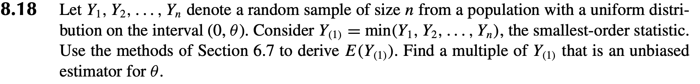

```{r setup, include=FALSE}
knitr::opts_chunk$set(echo = TRUE, message=FALSE)
library(ggplot2)
library(tidyverse)
library(gganimate)

set.seed(1234)    ## change this randomization seed if you want to see different results
```

## Recall Exercise 8.18:

```{r pressure, echo=FALSE, fig.cap="", out.width = '100%'}

```

We showed that $E[Y_{(1)}] = \frac{1}{n+1} \cdot \theta$.

So $\hat{\theta_1} = (n+1) \cdot Y_{(1)}$ is an unbiased estimator of $\theta$ 

(since $E[(n+1) \cdot Y_{(1)}] = \frac{n+1}{n+1} \cdot \theta = \theta.$)

## Consider what this esitimator looks like in practice

Consider the following situation with, say, $\theta=1000$ and $n=500$.

Recall that in practice, we would not know what $\theta$ was, otherwise we would have no need of estimating it! 
However, here we are thinking about the quality of our estimator, so we are going to use a simulation study where we have picked (with no loss of generality) a specific numerical value for $\theta$, and we are going to look at how well our estimator does at actually estimating $\theta=1000$. 


So, let's generate a world where $\theta=1000$, $n=500$, and $Y_i \sim unif(0, \theta)$ for $i=1,\ldots, n$:

```{r}
theta = 1000
n = 500
y = tibble(run = 1:n, value=runif(n = n, min=0, max=theta))
theta_hat_min = tibble(estimate=(n+1)*min(y$value), simulation=1)
```

Now plot the observed values:
```{r}
p = ggplot(y, aes(value, 1)) +
		geom_point(alpha=.2, size=10, shape=3) + 
		theme(axis.text.y=element_blank(),  #remove y axis labels
        axis.ticks.y=element_blank()  #remove y axis ticks
        )+
		ylab("") # remove ylabel

p
```

Now add in a red line showing the minimum observed value:

```{r}
p + geom_vline(aes(xintercept = min(value)), col="red", lty=2)
```

Now add in a blue line showing the estimated value of $\theta$ and a green line showing the true value of $\theta$:

```{r}
p + geom_vline(aes(xintercept = min(value)), col="red", lty=2) +
	geom_vline(xintercept = theta_hat_min$estimate, col="blue", lty=3) +
	geom_vline(xintercept = theta, col="green", lty=4)
```


## Explore the properties of this estimator empirically through simulation

Now, let's repeat this process many many times, so that we can get a distribution of estimates

```{r}
for(i in 2:1000)
{
	y = tibble(run = 1:n, value=runif(n = n, min=0, max=theta))
	theta_hat_min = rbind(theta_hat_min, c((n+1)*min(y$value), i))
}
```

Now plot all the observed estimates along with a green line showing the true value of $\theta$:
```{r}
p + 
	geom_vline(xintercept = theta_hat_min$estimate, col="red", alpha=.1) + 	
	geom_vline(xintercept = theta, col="green", lty=4)
```


This would be easier to understand if we used a more appropriate plot, say a histogram:
```{r}
p = ggplot(theta_hat_min, aes(estimate)) +
		geom_histogram(bins=30)
p  + 	geom_vline(xintercept = theta, col="green", lty=4)
```


We can see that the estimator is unbiased: the mean of the distribution of estimates is at the true value of $\theta$:

```{r}
theta_hat_min %>% 
	summarize(mean=mean(estimate), bias= mean(estimate-theta))
```

_Aside: Note that the empirical bias is not precisely 0 because we are only estimating the true expected value using the observed (sample) mean of the simulations._


However, we can also see that the variance and (therefore) MSE of this estimator are very large:

```{r}
theta_hat_min %>%
	summarize(mean=mean(estimate), bias = mean(estimate-theta), var = var(estimate), mse=mean((estimate-theta)^2))
```
_Remember that the true MSE and variance are identical because the estimator is unbiased. Any differences are a result of us approximating the truth using simulations._

## Consider other potential estimators

Now let's consider estimating $\theta$ using the sample mean $\bar{Y}$. 

We know that

$$E[\bar{Y}] = \int_{-\infty}^\infty y \cdot f(y)\  dy$$

Since $Y\sim unif(0, \theta)$,  $f(y)=1/\theta, \quad 0<y<\theta$, so

$$E[\bar{Y}] = \int_{0}^\theta y \cdot 1/\theta \ dy = \frac{\theta}{2}.$$
Therefore, $\hat{\theta}_2 = 2\cdot \bar{Y}$ is also an unbiased estimator of $\theta$ (since $E[\hat{\theta}_2] = \theta$). 


Similarly, we can show (and you should be able to show -- on a test, for instance!) that 

$$E[Y_{(n)}] = \frac{n}{n+1} \theta$$

so another unbiased estimator of $\theta$ is 

$$\hat{\theta}_3 = \frac{n+1}{n} Y_{(n)}.$$ 

## Compare these estimators for a single data set

Let's consider using all three estimators with the same data:

```{r}
theta = 1000
n = 500
y = tibble(run = 1:n, value=runif(n = n, min=0, max=theta))
theta_hat = tibble(
									estimate1=(n+1)*min(y$value), 
									estimate2 = 2*mean(y$value),
									estimate3 = (n+1)/n * max(y$value),
									simulation=1)
```

Now plot the observed values:
```{r}
p = ggplot(y, aes(value, 1)) +
		geom_point(alpha=.2, size=10, shape=3) + 
		theme(axis.text.y=element_blank(),  #remove y axis labels
        axis.ticks.y=element_blank()  #remove y axis ticks
        )+
		ylab("") # remove ylabel

p
```

Add in the estimates (red for $\hat{\theta_1} = (n+1) \cdot Y_{(1)}$, green for $\hat{\theta}_2 = 2\cdot \bar{Y}$, blue for $\hat{\theta}_3 = \frac{n+1}{n} Y_{(n)}$): 

```{r}
p + geom_vline(xintercept = theta_hat$estimate1, col="red") +
	geom_vline(xintercept = theta_hat$estimate2, col="green") +
	geom_vline(xintercept = theta_hat$estimate3, col="blue") + 
	geom_vline(xintercept = theta, col="black", alpha=.5)
```

The observed estimates here were 
```{r}
theta_hat[,1:3]
```

## Compare these estimators empirically

Now let's repeat this process many, many times (i.e., run a simulation study):
```{r}
for (i in 2:1000){
	y = tibble(run = 1:n, value=runif(n = n, min=0, max=theta))
	theta_hat = rbind(theta_hat, 
								tibble(estimate1=(n+1)*min(y$value), 
									 estimate2 = 2*mean(y$value),
									 estimate3 = (n+1)/n * max(y$value),
									 simulation=i))
}
```

Consider the same plot as before, but with all of the observed estimates over the entire simulation study:

```{r}
p + geom_vline(xintercept = theta_hat$estimate1, col="red", alpha=.1) +
	geom_vline(xintercept = theta_hat$estimate2, col="green", alpha=.1) +
	geom_vline(xintercept = theta_hat$estimate3, col="blue", alpha=.1) + 
	geom_vline(xintercept = theta, col="black", alpha=.5)
```

Again, this would be easier to see by looking at histograms:


```{r}
theta_hat = theta_hat %>% pivot_longer(1:3)

p = ggplot(theta_hat, aes(value, colour=name, fill=name)) +
		geom_histogram(alpha=.3, bins=30)
p  + 	geom_vline(xintercept = theta, col="black", lty=4)
```

Clarify the plots further by displaying each histogram separately:

```{r}
p  + 	geom_vline(xintercept = theta, col="black", lty=4) + 
	facet_wrap(vars(name),  nrow=3)
```

To give a better idea of each distribution, let's zoom in each plot to where the estimates are actually observed (_note that the x-axes are no longer the same in the different plots_):

```{r}
p  + 	
	geom_vline(xintercept = theta, col="black", lty=4) + 
	facet_wrap(vars(name),  nrow=3, scales = "free")
```

As you can see, these estimators have very different properties despite all being unbiased. 
Our original estimator had a very large variance.
The estimator based on the maximum had the smallest variance. 

Note also that only the estimator based on the mean appears to be normally distributed (again: the central limit theorem only applies to _sample means_).


Finally, let's examine the empirical estimates of bias, variance, and MSE of these estimators:

```{r}
theta_hat %>% 
	group_by(name) %>% 
	summarize(mean=mean(value), bias = mean(value-theta), var = var(value), mse=mean((value-theta)^2))
```


### Aside: distribution of minimum and maximum 
There was a question in class about the distribution of the minimum and maximum of the uniform random variable. 

We found that 
$$f_{Y_{(1)}}(y) = \frac{n}{\theta} (1-y/\theta)^{n-1}$$
and that 
$$f_{Y_{(n)}}(y) = \frac{n}{\theta} (y/\theta)^{n-1}.$$

These are (scaled) examples of the beta distribution:
$$f(y) = \frac{y^{\alpha-1}(1-y)^{\beta-1}}{B(\alpha, \beta)}.$$

In other words, the distribution of the minimum of $n$ $unif(0,1)$ random variable is $Beta(1, n)$ and the distribution of the maximum is $Beta(n,1)$. (_note: this is something that you would have proven in STAT 2910 and an argument that you should understand in STAT 3910_)

Let's see how this works in this setting.

First, recover the minimum values from the estimates:
```{r}
theta_min = theta_hat %>% filter(name=="estimate1") %>% mutate(value=value/(n+1))
```

Now, plot these minimum values and overlay with a $Beta(1, n)$ density curve:
```{r}
ggplot(theta_min, aes(value)) +
    geom_histogram(alpha=.5, binwidth=1, boundary=1) + 
    stat_function(fun = function(x){dbeta(x/theta, shape1=1, shape2=n)})
```


This time, try it with the maximums:
```{r}
theta_max = theta_hat %>% filter(name=="estimate3") %>% mutate(value=value*n/(n+1))

ggplot(theta_max, aes(value)) +
    geom_histogram(alpha=.5, binwidth=1, boundary=1) + 
    stat_function(fun = function(x){dbeta(x/theta, shape1=n, shape2=1)})
```


We know that the means are approximately normally distributed: 
```{r}
theta_mean = theta_hat %>% filter(name=="estimate2") %>% mutate(value=value/2)

ggplot(theta_mean, aes(value)) +
    geom_histogram(aes(y=..density..), alpha=.5, binwidth=1, boundary=1) + 
    stat_function(fun = dnorm, args=list(mean=mean(theta_mean$value), sd=sd(theta_mean$value)))
```
